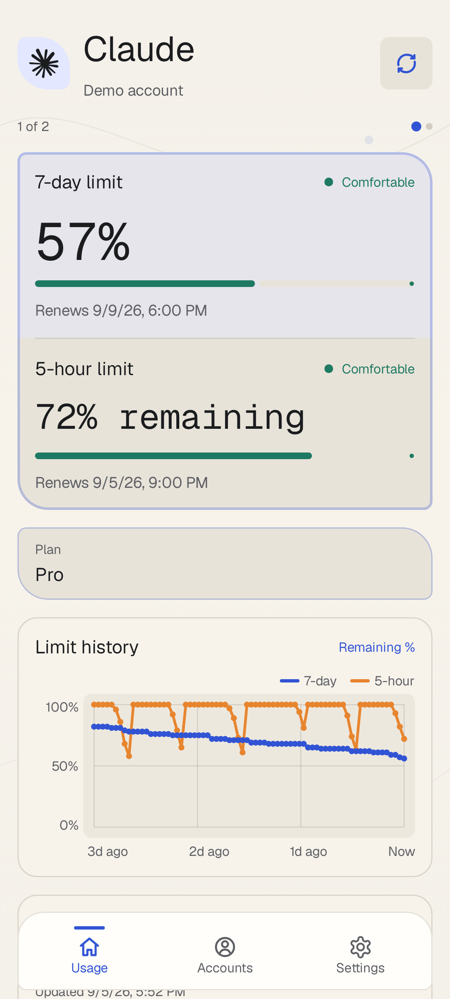
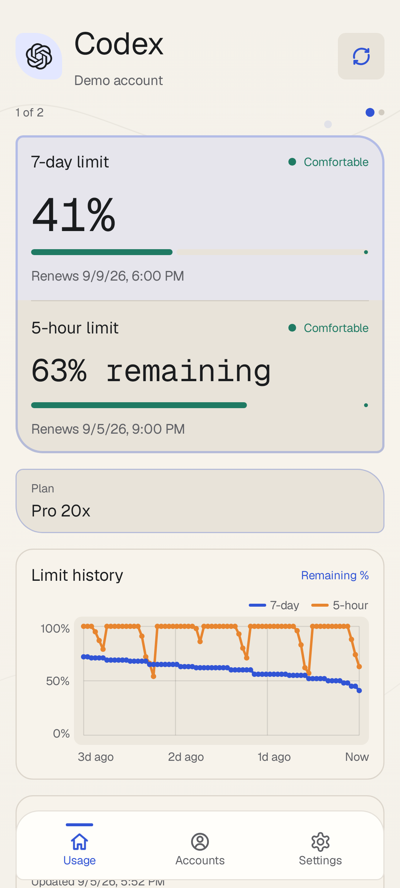
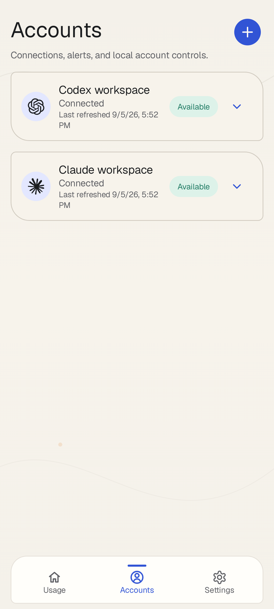
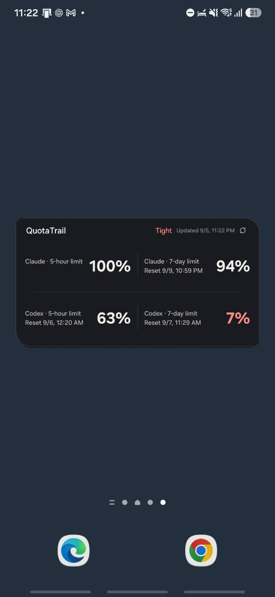
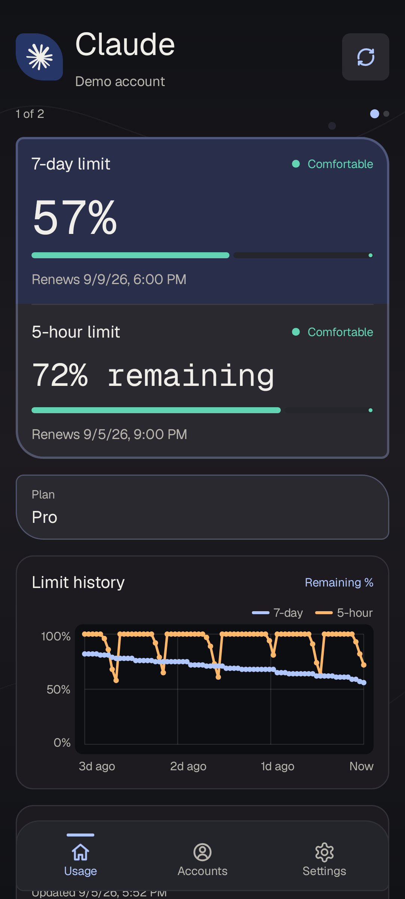
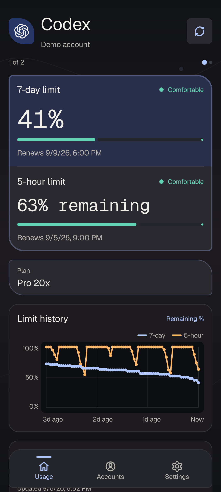
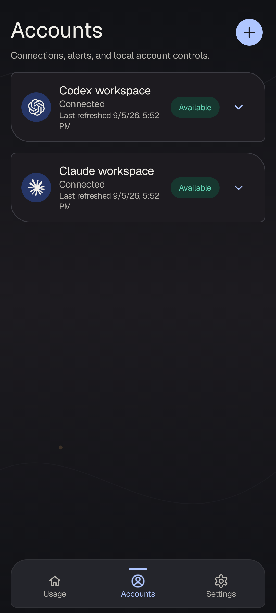

# QuotaTrail

QuotaTrail is a small Android app that keeps Claude and Codex usage limits visible.

[](https://developer.android.com/about/versions/12)
[](LICENSE)

It reads provider-hosted usage endpoints and keeps the result on the device. The same
account data is available in the app, an optional home-screen widget, and an ongoing notification.

## Screenshots

| Claude | Codex | Accounts | Widget |
| :---: | :---: | :---: | :---: |
|  |  |  |  |

<details>
<summary>Dark mode</summary>

<p align="center">
  
  
  
</p>
</details>

<p align="center"><sub>App previews use sample data; the widget photo contains no account identifiers.</sub></p>

## Features

- Claude and Codex accounts, with multiple accounts per service.
- 5-hour and 7-day remaining quota, reset times, and refresh status.
- A 72-hour history chart for both quota windows.
- Four independently configured widget slots.
- One-tap refresh for the app, widget, and ongoing notification.
- Local encrypted session storage and re-login detection.

## Connections

| Service | Sign-in |
| --- | --- |
| Claude | OAuth in the browser; paste the one-time authorization code into the app |
| Codex | Device-code authorization in the browser |

QuotaTrail is an unofficial integration, not an approved third-party API client. Provider changes
can interrupt sign-in or usage retrieval. It does not send prompts or run model requests.

## Refresh and history

Background refresh runs on Android's scheduler at intervals of 15 minutes or longer. Battery
restrictions, offline periods, and system load can delay it. A widget tap first queues a request;
the app reports when work starts and when it finishes or needs a retry. Repeated taps keep the
existing request instead of interrupting an in-progress token refresh.

History starts when an account is connected. The chart shows hourly averages of locally observed
remaining percentages over the last 72 hours; it cannot recover earlier usage and may have gaps.
Each widget slot can select its own account and quota window. Smaller widget sizes show fewer slots.

Enable notifications in Android to use the ongoing status display and quota alerts. Lock-screen
visibility also depends on the phone's notification and privacy settings.

## Privacy

Sessions are encrypted with Android Keystore-backed AES-GCM and remain on the device. QuotaTrail
does not provide cloud sync, ads, analytics, remote logging, or a quota proxy. Credentials, cookies,
OAuth codes, and raw provider responses are not written to logs or diagnostics.

## Install

Download the signed APK from [GitHub Releases](https://github.com/plainpacket/QuotaTrail/releases/latest).
Because the APK is distributed outside Google Play, Android may ask to scan or confirm it during
the first installation. Check that the download came from this repository before continuing.
Install updates over the existing QuotaTrail app; the signing identity is kept across releases.
QuotaTrail is an unofficial client and is not affiliated with Anthropic or OpenAI.

## Build

Use Android Studio with SDK 37 and JDK 17:

```bash
./gradlew :app:testDebugUnitTest
./gradlew :app:lintDebug
./gradlew :app:assembleDebug
```

The release workflow runs unit tests and lint before signing and publishing. It expects the
repository signing key. Do not commit keystores or local
credentials; see [CONTRIBUTING.md](CONTRIBUTING.md) for the project rules.

## Source

This repository is an actual fork of [KyoMio/CodexMeter](https://github.com/KyoMio/CodexMeter),
substantially reworked and maintained as QuotaTrail. The original MIT terms and attribution are
preserved in [NOTICE.md](NOTICE.md).

## License

Application code: MIT. See [LICENSE](LICENSE) and [NOTICE.md](NOTICE.md).
Bundled fonts: SIL Open Font License 1.1; see the [font notices](app/src/main/res/raw/font_licenses.txt).
